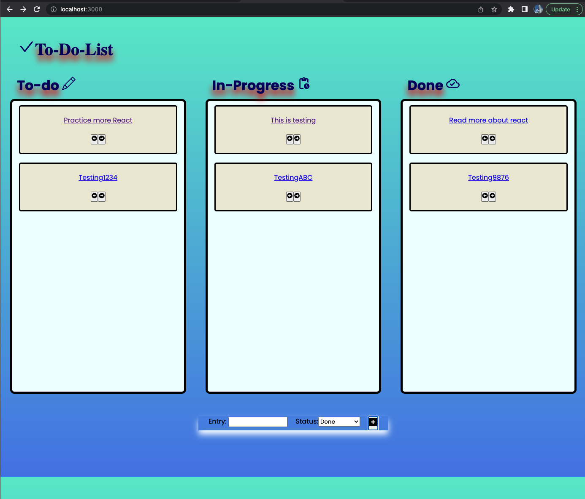
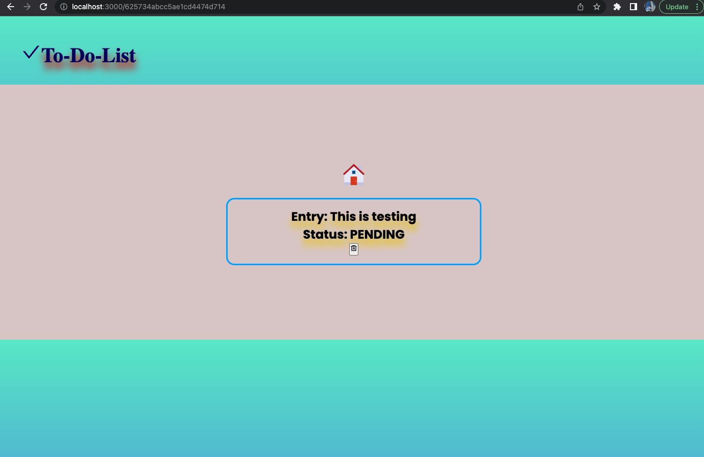
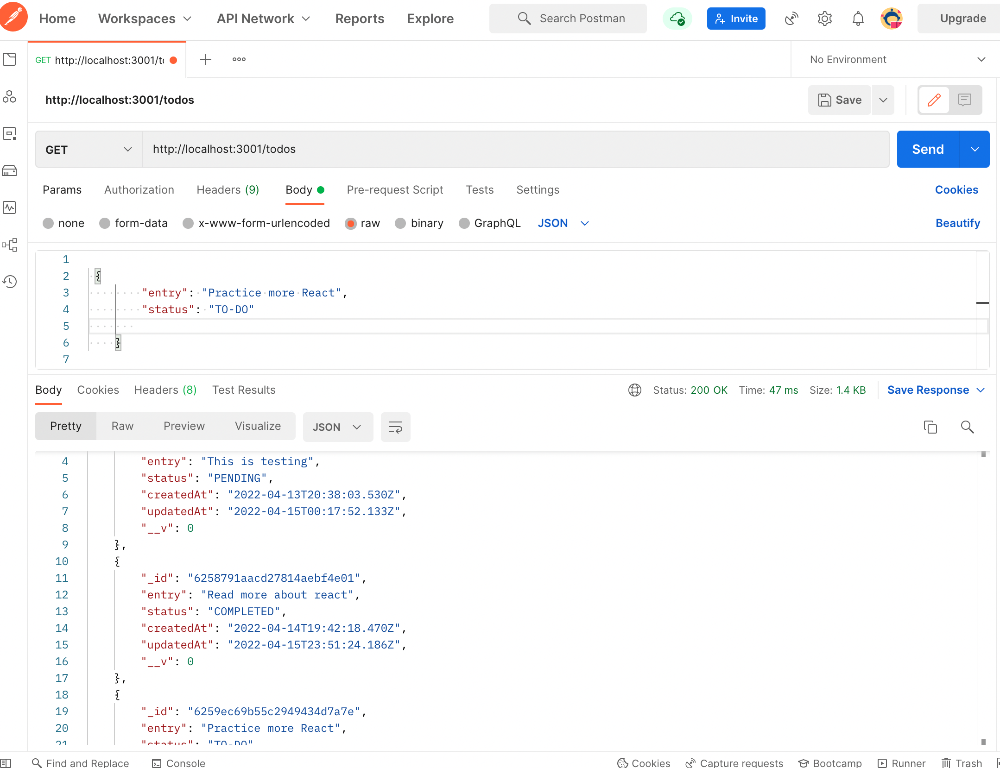
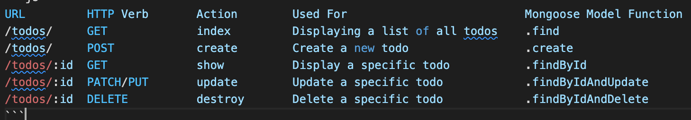

# Full-Stack-React-To-Do-list

### Learning Objectives
- React State
- Controlling Input in React
- Rendering Data with React
### Prerequisites
- React State
- React Props
- Capturing Input

## Requirements
- When the page loads, your app should render a list of items from an array of data.
- If the item is not completed, render the item on the page.
- Your app should have an input that allows the user to enter a new item to the to do list.
- When the user submits the form (presses enter) the value in the input should be added as an item on your to do list.

# Frontend

`The way this Todo List app works is pretty simple. Type in a task or item or whatever you want into the input field and press Add (+) . Once you've submitted your item, you will see it appear as an entry. You can keep adding item to add additional entries and move the arrow <- ->:`

`To remove an item, just click on an existing entry. It's will show to another page and click the trash-can to removed the item(s). Click Home to return to todo list entry:`

# Backend

## Todo Api with MongoDB, Express and Node

### Build API Add Cors Deploy to Heroku

### Technologies Used:

- MongoDB
- Express
- React
- NodeJS
- JavaScript
- Npm
- JSX
- CSS
- HTML
- VScode
- Git
- GitHub
- Postman
- Heroku